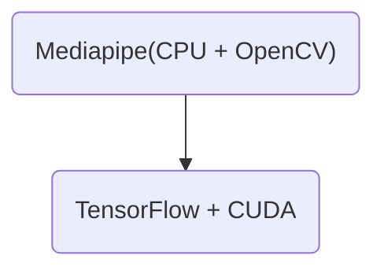

#### 카메라 기반 손동작 인식 및 제스처 분석 기능

카메라를 어떤 방식으로 연결할 것인가?
1. LAN
2. Computer에 직접 꽂기 (유선 연결)
3. Bluetooth 전송
4. Board 연결해서 영상을 전송받는 방식
e.g.
냉장고 디스플레이 (해당 기기 내에 카메라 내장)

#### 스마트홈 가전 기기 제어 (조명, 선풍기, TV, 에어컨 등)
스마트홈 기기 제어?
- 220V를 사용하는 가전제품까지 가정해야하는 건지 `위험 동반`
- 규모가 작아도 가전기기로 쳐주는가?

#### 스마트폰 앱 또는 웹 대시보드에서 기기 상태 확인 가능
- 웹 대시보드: Flask/Streamlit + Chart.js
- 앱: 웹앱?

#### Payment
- 니퍼
- 아두이노 Uno R4 WiFi
- 릴레이모듈
- 전기테이프
- ~~납땜~~

#### $+\alpha$) 논문 (Due Date -5/2)
- 공통저자
- 도현님과 수현님의 참여도 여부
	- 노가다 작업 `참고문헌, 양식`

