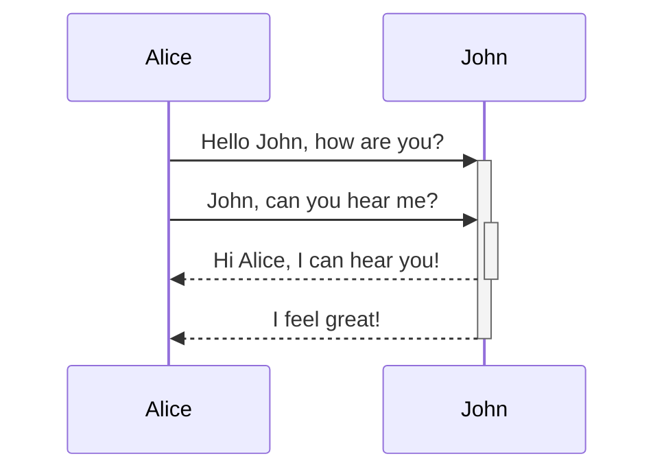
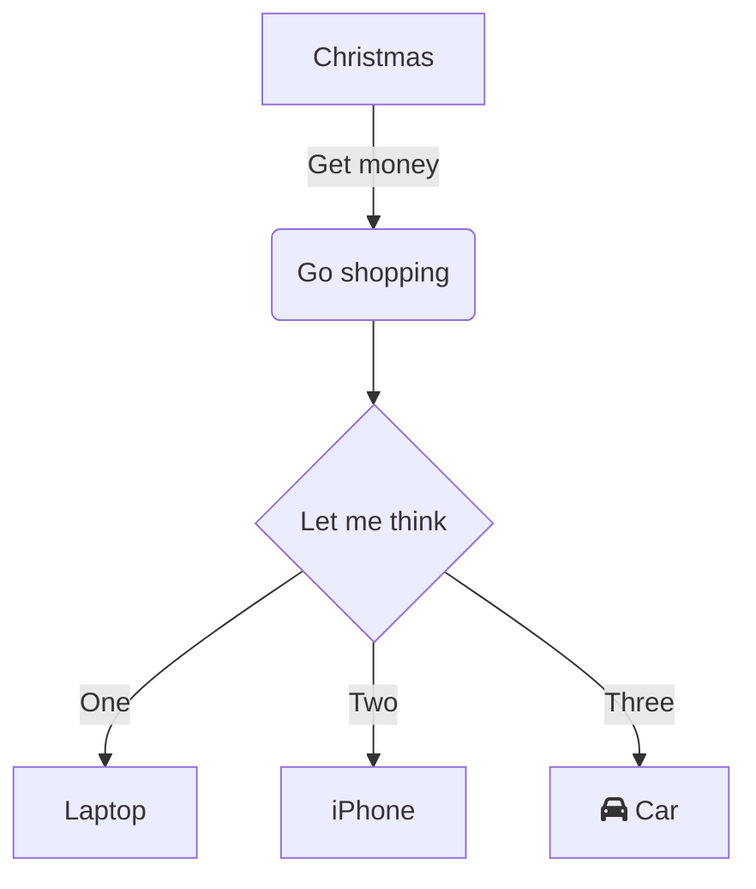
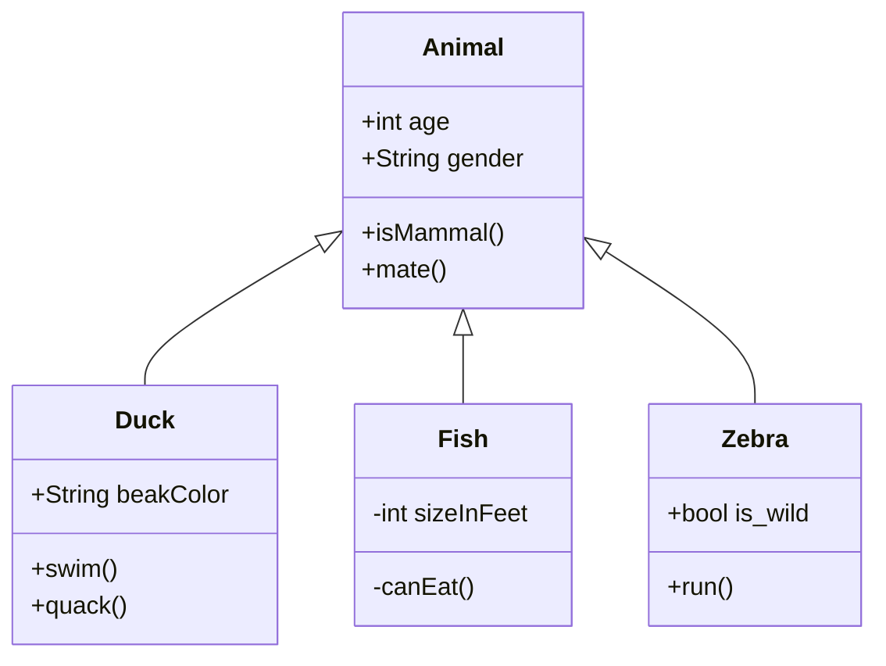
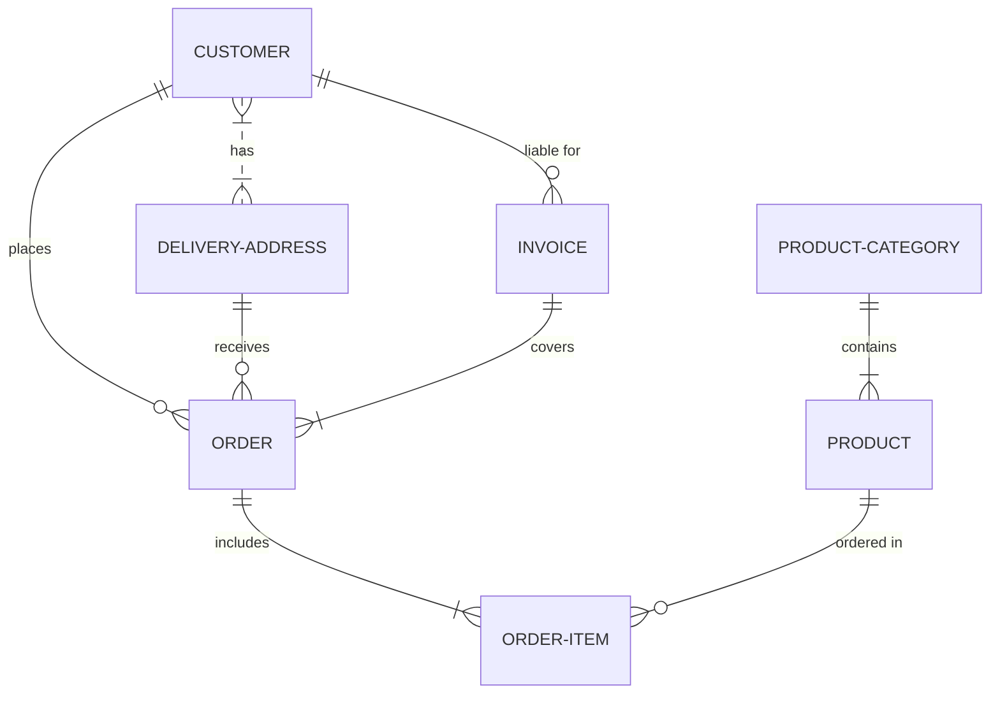
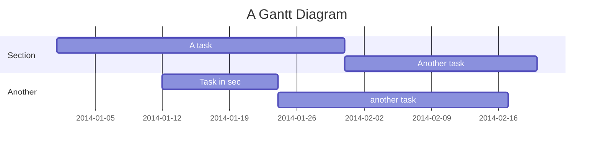
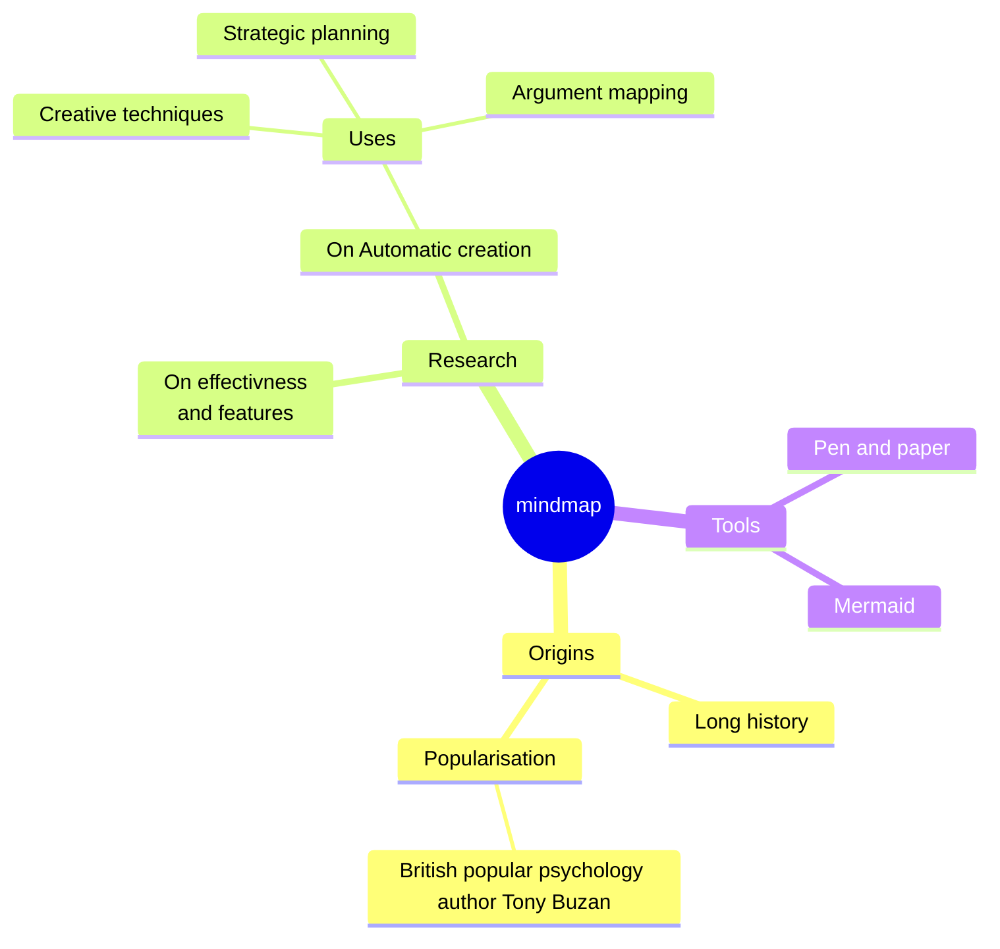

#### Reference
[Mermaid를 사용해서 각종 Diagram 및 개발문서 만들기 (tistory.com)](https://holjjack.tistory.com/296)

#### Sequence Diagram
> Sequence Diagram은 시간의 흐름에 따른 객체 간의 상호작용을 보여주는 다이어그램

#### Flow Chart
> 일련의 작업 또는 프로세스를 시각적으로 표현하는 차트

#### Class Diagram
> 시스템의 구조를 나타내는 정적 다이어그램

#### Entity Relationship Diagram
> 데이터베이스에서 엔티티 간의 관계를 보여주는 다이어그램

#### Gantt Chart
> 프로젝트 일정을 시각적으로 표현하는 차트

#### Mindmap
> 아이디어나 정보를 시각적으로 구조화하는 도구

