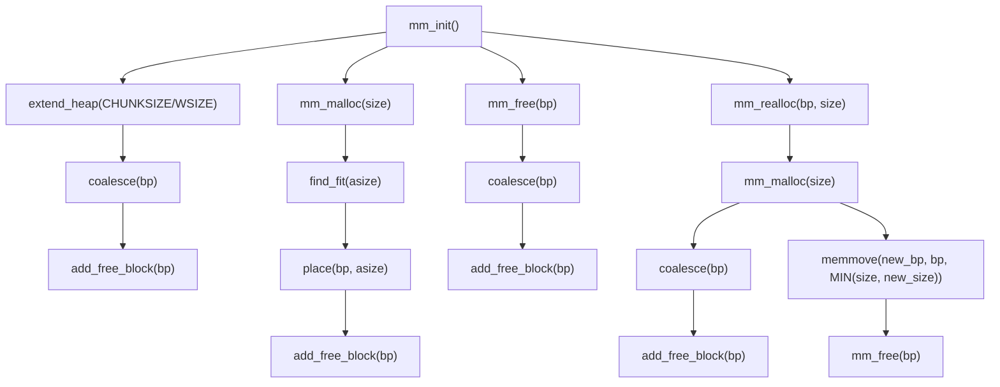

# Project #1: MyLib

- 조건은 다음과 같다.
	- 모든 input은 STDIN input이다.
	- 모든 input과 output은 소문자이다.
	- 프로그램에서 쓰이는 자료형은 모두 int이다.
	- Hash table의 hash 함수로 hash_int() 를 사용할 것. `hash.c에 있다.` 그래도 hash_int_2() 는 구현해야 한다.
	- Return type이 boolean일 경우 true와 false를 써야 한다.
	- List, hash table, bitmap의 개수는 10개 이하이다.
	- 주어진 소스 코드의 함수를 필요시 사용할 수 있다.

- 팁은 다음과 같다.
	    - swap에서 0번째와 1번쨰 요소를 swap할 때 그냥 구현하면 프로그램이 종료될 것이다.
    - size_t를 print 할 때는 `printf(“%zu”, a);` 다음과 같이 %z를 써서 하여라.

- 내가 스스로 구현해야 할 함수는 다음과 같다.
	- create list list_name
	- create hashtable hashtable_name
	- create bitmap bitmap_name bitmap_count
	- delete list/hashtable/bitmap_name
	- dumpdata list/hashtable/bitmap_name
	- quit


모든 입력은 `char*`형 buf에 받는다.
buf를 command_handler에 인자로 전달하여 command와 datastructure 및 인자로 정리한다.
	첫 command는 반드시 create이다. 이 create뒤의 인자에 따라 실행할 함수의 종류가 달라진다. (list/hashmtable/bitmap)
datasutructure_name과 실제 자료구조 이름과의 연계는 map으로 한다.
최종 실행 명령어의 형태는 command, datastructure_namd, 인자의 형태로 될것이다.

# Project #2: MyShell
#### Phase 1
ch dir
exit자체를 하면 shell자체에서 나가지기 때문에 while문을 빠져나가도록 코딩

구현해야하는 것 중 Built-in command는 다음과 같다.
1. `cd [-L|[-P [-e]] [-@]] [dir]`
2. `echo [-neE] [arg ...]`
3. `exit [n]`
이미 구현되어있는 command는 다음과 같다.
1. `ls`
2. `mkdir, rmdir`
3. `touch, cat`

#### Phase 2
child한 개에서는 ls라는 command를 실행시켜서
dv라는 커맨드로 output을 넘겨주고
그 child process에서 gref로 실행

#### Phase 3
포그라운드 프로세서: 유저들이 볼수있도록 프로세서가 앞에서 돌아가는 것
백그라운트 프로세서: 보이지 않고 뒤에서 돌아가는 프로세서
명령어 뒤에 &를 붙이면 백그라운드 프로세서로 돌아간다.
마지막에 & 포인터를 붙이면 된다고 생각하면 된다.

#### Plus alpha
phase는 소문자로만 쓰기

[zsh/Src/jobs.c at master · zsh-users/zsh (github.com)](https://github.com/zsh-users/zsh/blob/master/Src/jobs.c)

## Phase 1: Building and Testing Your Shell

### Implemented command
#### Built-in Command
```
cd, echo, exit
```
- **`cd`:**
	Shell에서 directory 탐색
	`cd ..`: 부모 디렉토리로 이동한다.
- **`echo`:**
	Standard output에 인수를 작성한다.
	`"argument"`의 경우 argument만 출력한다.
- **`exit`:**
	Shell을 종료한다.
#### External Command
```
ls, mkdir, rmdir, touch, cat, echo
```

### Excecute Example
```myshell
/* ls */
CSE4100-SP-P2> ls
Makefile  README.md  csapp.c  csapp.h  myshell  myshell.c

/* mkdir */
CSE4100-SP-P2> mkdir myshell-dir
CSE4100-SP-P2> ls
Makefile  README.md  csapp.c  csapp.h  myshell  myshell-dir  myshell.c

/* rmdir */
CSE4100-SP-P2> rmdir myshell-dir
CSE4100-SP-P2> ls
Makefile  README.md  csapp.c  csapp.h  myshell  myshell.c

/* touch */
CSE4100-SP-P2> mkdir myshell-dir
CSE4100-SP-P2> touch myshell-dir/cse4100
CSE4100-SP-P2> cd myshell-dir
CSE4100-SP-P2> ls
cse4100

/* cd */
CSE4100-SP-P2> cd ..
CSE4100-SP-P2> ls
Makefile  README.md  csapp.c  csapp.h  myshell  myshell-dir  myshell.c

/* cat */
CSE4100-SP-P2> cat Makefile
CC = gcc
CFLAGS = -Og -g
LDLIBS = -lpthread

PROGS = myshell

all: $(PROGS)

myshell: myshell.c csapp.c

clean:
        rm -rf *~ $(PROGS)

/* echo */
CSE4100-SP-P2> echo myshell.c
myshell.c
CSE4100-SP-P2> cd
CSE4100-SP-P2> ls
Study  UNIV  Workspace  a.out  enter

/* exit */
CSE4100-SP-P2> exit
```

## Phase2: Redirection and Pipe

### Implemented Operation
#### Pipe
```
cmd1 | cmd2 | cmd3 ...
```
- cmd1 out->in cmd2 out->in cmd3 out-> ...
- 구현 flow는 다음과 같다.
	- `pipe(pipefds[])`: out과 in을 연결할 pipe를 원하는 개수만큼 생성
	- `Dup2(pipefds[], STDIN_FILENO/STDOUT_FILENO)`: 파이프를 각각의 프로세스에 적절히 연결한다.
	- `Close(pipefds[])`: 사용하지 않을 파이프를 제거한다.

### Execute Example
```myshell
CSE4100-SP-P2> ls | grep myshell.c
myshell.c
CSE4100-SP-P2> cat myshell.c | less
CSE4100-SP-P2> cat myshell.c | grep -i "pipe" | sort -r
        int pipefds[2 * (cmdc - 1)];
                if(pipe(pipefds + i * 2) == -1) {
                Close(pipefds[i]);
                        perror("pipefd");
                                        Dup2(pipefds[i * 2 + 1], STDOUT_FILENO);
                                        Dup2(pipefds[(i - 1) * 2], STDIN_FILENO);
                                        Close(pipefds[j]);
CSE4100-SP-P2> cat myshell.c | grep -i "pipe" | sort -r | grep -i "Dup2"
                                        Dup2(pipefds[i * 2 + 1], STDOUT_FILENO);
                                        Dup2(pipefds[(i - 1) * 2], STDIN_FILENO);
```

## Phase3: Run Processes in Background

### Implemented Operation
#### Background Process
```
cmd &
cmd1 | cmd2 &
```
- 뒤에 `&`인자가 붙으면 cmd는 백그라운드에서 돌아가고, job 리스트에 추가된다.
- 구현 flow:
	- child가 fork되면 `Sigprocmask`로 사용자 지정 시그널(`SIGCHLD, SIGINT, SIGTSTP 등)을 차단한다.
	- parent에서는 child process가 포그라운드에서 돌아가면 `Sigsuspend(&empty)`를 통해 시그널을 다시 받는다. 백그라운드일 경우 아무 작업도 취하지 않는다.
	- 모든 작업이 끝나면 `Sigprocmask(prev)`를 통해 다시 전 상태로 되돌린다.
	- 시그널은 시그널 핸들러를 통해 핸들링한다.

#### Job Commands
```
jobs, bg, fg, kill
```
- `jobs`: running 또는 stooped 상태의 백그라운드 프로세스를 출력한다.
- `bg %idx`: 해당 idx의 job를 백그라운드에서 실행시킨다.
- `fg %idx`: 해당 idx의 job를 포그라운드에서 실행시킨다.
- `kill %idx`: 해당 idx의 job를 중지(terminate)한다.

### Execute Example
```myshell
/* background process */
CSE4100-SP-P2> ./a.out &
CSE4100-SP-P2> ./a.out &
CSE4100-SP-P2> ./a.out &
CSE4100-SP-P2> ./a.out
^Z

/* jobs */
CSE4100-SP-P2> jobs
[1] running ./a.out
[2] running ./a.out
[3] running ./a.out
[4] suspended ./a.out

/* bg */
CSE4100-SP-P2> bg %4
[4] running ./a.out
CSE4100-SP-P2> jobs
[1] running ./a.out
[2] running ./a.out
[3] running ./a.out
[4] running ./a.out
CSE4100-SP-P2> bg %5
No Such job

/* kill */
CSE4100-SP-P2> kill %2
CSE4100-SP-P2> jobs
[1] running ./a.out
[3] running ./a.out
[4] running ./a.out

/* fg */
CSE4100-SP-P2> ./a.out &
CSE4100-SP-P2> jobs
[1] running ./a.out
[3] running ./a.out
[4] running ./a.out
[5] running ./a.out
CSE4100-SP-P2> fg %6
No Such job
CSE4100-SP-P2> fg %5
[5] running ./a.out
^C
CSE4100-SP-P2> jobs
[1] running ./a.out
[3] running ./a.out
[4] running ./a.out
```


# Midterm

- True/false
- short term 개념 문제
- fork했을 때 어떤 식으로 구동이 되는지
- slide를 이해를 할 수 있으면 응용을 하면 다 풀 수 있을 수준의 문제

# Project #3: Stock Server

#### Goal
> 여러 client들의 동시 접속 및 서비스를 위한 Concurrent stock server 구축
- Server:
	주식 정보 저장
	여러 client들과 통신
	주식 정보 List 판매, 구매
- Client:
	Server에 주식 사기, 팔기, 가격과 재고 조회 요창

`Plus alpha:`  
	memory에 올릴 때 binary search tree로 만들게 되어있음  
	concurrent하게 사고파는 요청이 온다.  
    Event 기반:  
		process 하나가 조건문을 돌면서 실행  
	Thread 기반:  
		Pthread 여러개를 띄워서 connection마다 thread를 띄울 수도 있고  Thread pool을 만들어서 필요한 thread를 꺼내 쓸 수도 있고  

##### Background
- 강의자료 4, 5, 6

60184

##### 주식 `stock.txt`
```
ID  잔여 주식  주식 단가
1   7         10000
5   3         3700
:
// Client request - 잔여 주식 이상의 주식 요구: `"Not enough left stocks"` 출력
```
- 변동 되는 Data: `잔여 주식`
- Data structure: Binary Tree
```c
// Example
struct item {
	int ID;
	int left_stock;
	int price;
	int readcnt;
	sem_t mutex; // lock 변수
}
// ID는 [1 ~ ID_MAX] 사이에서 random unique id 발급
```
- Problem, Readers-writers:  
	client a가 item_i 주식을 읽을 때 다른 client b가 item_i를 업데이트 하게되면 올바르게 동작하지 않는다. `Read and write의 순서 문제`  
	-> Solution, fine-grained locking `노드 단위의 관리`  

##### Multiclient 실행 파일 `multiclient.c`
- 수정 가능 변수
```
#define MAX_CLIENT 100
#define ORDER_PER_CLIENT 10
#define STOCK_NUM 10
#define BUT_SELL_MAX 10
```
- 사용법
```
' ./stockserver 1119 먼저 실행 (stockclient와 달리 port번호 달라짐)
' Task1, Task2에서는 client# <= 4
' Zombie 또는 Orphan이 발생하지 않도록 주의하자.

~$ ./multiclient <host> <port> <client#>
```
  
##### Response Format
```
~$ [buy] success           // buy request 정상적으로 처리
~$ [sell] success          // sell request 정상적으로 처리
~$ Not enough left stocks  // but request에서 잔여 주식이 부족한 경우
```
  
#### Task1
> Event-driven Approach `using select()`

-> client: trigger `fd`  
-> server: `select()`에 의해 동작 시작  
	table(`stock.txt`)의 내용을 읽어 메모리에 적재 후 요청을 처리  
-> server: 동작 종료  
	업데이트 된 변경사항을 table(`stock.txt`)에 정해진 format으로 저장  
  
#### Task2
> Thread-based Approach `using pthread library`
- Pthread: Process-based Server와 비슷하나 Process 대신 Thread를 쓴다.  

#### Task3
> 성능 평가 및 분석
- Task1과 Task2d의 elapse time 측정 및 분석 후 보고서 기재
- Task3에 한정해서 4개 초과의 client process를 띄우는 것을 허용
- 분석 포인트:
	- 확장성: Client 개수 변화에 따른 동시 처리율 변화 분석
	- Workload: Client 요청 타입(buy, show, sell..)에 따른 동시 처리율 변화 분석
	- 수업과 비교: Branch 방법의 성능 또는 다양한 관점에서 비교 분석
	- 기타
  
#### 제출
- Contents:
	format: `prj3_20221623.tar.gz`
	
- Docs:
	format: `pdf`
	내용: `document.docx` 기반
- Date:
	~ 6/3 (지각 허용)

#### Caution
- Process Management:
	`ps -aux` 혹은 `top`를 통해 Background Process를 수시로 확인할 것

#### Tip
- 먼저 command string을 server가 concurrency하게 판독할 수 있도록 구현
	`./echoservert 1119` 를 만들자
- Responce 출력은 `multiclient.c`말고 `stockclient.c`를 실행시켜 command를 하나씩 입력하고 제대로 처리하는지 확인
- 채점은 stock.txt에 업데이트 내용이 제대로 반영되었는지 확인함으로써 진행한다.

# Project #4: Mallocator

## 1. Introduction

#### Goal
> 나만의 `malloc`, `free`, `realloc` 함수를 짜보자.
> 자료구조, 탐색 방식이 정확해야하고 효율적이며, 빨라야한다.

## 2. Materials

#### `mm.c`
> 이 파일만 수정하면 된다.

#### `mdriver.c`
> 내가 짠 코드를 테스트 할 수 있는 Tester이다. `./mdriver`로 실행한다.

## 3. Project Description

#### `mm.c`
> mm.c는 다음과 같은 함수들을 포함하게 될 것이다.
```c
int mm init(void);
void mm malloc(size t size);
void mm free(void *ptr);
void mm realloc(void *ptr, size t size);
```
각각의 함수에 대한 설명은 다음과 같다.

1. `mm_init`:
	- 다른 함수를 부르기 전, `mdriver.c` 같은 application 프로그램이 initialize를 위해 부르는 함수이다.
	- 반환값
		- `-1`: initializing에 문제가 생겼을 때
		- ` 0`: 다른 모든 경우
2. `mm_malloc`:
	- 이 루틴은 최소 크기 byte가 할당된 allocated block payload에 포인터를 반환한다.
	- 전체 allocated block은 heap내에 있으며 다른 allocated block과 겹치면 안된다.
	- 반환할 포인터는 비교 기준이 되는 `libc`의 `malloc`과 마찬가지로 8-byte 크기의 포인터이다.
3. `mm_free`:
	- `ptr`로 가리킨 block을 free한다.
	- `ptr`의 조건은 `mm_malloc`이나 `mm_realloc`으로 불리고, 아직 free되지 않은 `ptr`이다.
	- 반환값
		- 아무것도 반환하지 않는다.
4. `mm_realloc`:
	- 기본적으로 `ptr`로 가리킨 block의 크기를 `size` byte로 바꾸고 새 block의 address를 반환한다.
	- 새 block의 주소가 전 주소와 같을지는 당신의 implementation 또는 old block의 fragmentation, `size`의 크기에 따라 달라질 것이다.
	- 새로 생긴 공간은 아직 uninitialize된 상태로 냅둔다.
	- 이 함수의 동작을 조건에 따라 분리해보면 다음과 같을 것이다.
		- `ptr == NULL`: `mm_malloc(size)`와 같은 동작
		- `size == 0`: `mm_free(ptr)`와 같은 동작
		- `ptr != NULL`: 기본 동작

정확한 `malloc`의 동작을 알고 싶으면 `man malloc` 명령어를 shell에서 쳐보자.
`README` 파일도 많은 도움이 되니 꼭 읽어보자.

## 4. Heap Consistency Checker

#### Heap Checker `mm_check`
> malloc은 매우 복잡한 함수이기 때문에 Heap의 일관성, 즉 consistency를 확인하기 위해 이 checker가 필요할 것이다.

포함 가능한 체크 목록은 다음과 같다.
- free list의 모든 block은 free로 mark 되어 있는가?
- coalescing이 안 된 연속적인 free block이 있는가?
- 모든 free block이 free list에 있는가?
- free list에 있는 포인터들이 valid free block을 가리키는가?
- allocated block이 서로 겹치는가?
- heap block의 포인터들이 valid heap address를 가리키는가?

`mm_cheack`
- 만약 heap이 일관성이 있으면 non-zero 값을 반환한다.
- 위 함수에 있는 check에만 국한되지 않으며 모든 check를 확인해야 하는 건 아니다.
- mm_check이 실패할 경우 오류 메시지를 출력하는 것을 권장한다.
- 제출 시에는 관련 출력들을 모두 제거하도록 하자.

## 5. Supporting Routines

#### `memlib.c`
> 내가 만든 동적 메모리 할당기의 메모리 시스템을 시뮬레이션한다.

활용 가능한 함수는 다음과 같다.
```c
void *mem_sbrk(int incr);
void *mem_heap_lo(void);
void *mem_heap_hi(void);
size_t mem_heapsize(void);
size_t mem_pagesize(void);
```
각각의 함수에 대한 설명은 다음과 같다.

1. `void *mem_sbrk(int incr)`:
	- `incr` byte만큼 heap을 늘리고 새로 할당된 heap 공간의 첫 번째 byte를 가리키는 일반 포인터를 반환한다. `sbrk`와 같다고 생각하면 된다.
1. `void *mem_heap_lo(void)`:
	- heap의 첫번째 byte를 가리키는 일반 포인터 반환
2. `void *mem_heap_hi(void)`:
	- heap의 마지막 byte를 가리키는 일반 포인터 반환
3. `size_t mem_heapsize(void)`:
	- 현재 heap 크기를 byte로 반환
4. `size_t mem_pagesize(void)`:
	- system의 page 크기를 byte로 반환 `Linux system에선 4K`

## 6. The Trace-driven Driver Program

#### `mdriver.c`
> 내가 만든 동적 메모리 할당기의 정확도, 공간 활용도, throughput을 검사한다.

다음과 같은 환경변수를 통해 
- `-t <tracedir>`: `config.h`에 정의되어있는 디폴트 trace 파일 이외의 파일을 찾는다.
- `-f <tracefile>`: `config.h`에 정의되어있는 디폴트 trace 파일 이외의 특정 파일을 사용.
- `-h`: 명령 인수에 대한 정보를 출력한다.
- `-l`: `libc malloc`도 함께 검사해서 내가 만든 것과 비교할 수 있게 해준다.
- `-v `: 각 tracefile의 performance 결과를 간단한 table로 출력한다.
- `-V`: 각 tracefile의 performance 결과에서 더 많은 정보를 출력한다.

## 7. Programming Rules

프로그래밍 시 다음과 같은 주의사항이 있다.
- mm.c의 기본 틀은 바꿔선 안된다.
- `malloc`, `calloc`, `free`, `realloc`, `sbrk`, `brk` 같은 메모리 관리 함수의 호출은 일절 금지한다.
- 전역 변수 혹은 static 자료구조를 선언해서는 안된다. 하지만 전역 `int`, `float`, `pointer` 변수는 선언 가능하다.
- 항상 8-byte 경계에 정렬된 포인터를 반환해야 한다. 이는 driver가 enforce 할 것이다.

## 8. Evaluation

버그가 있거나 드라이버를 해치는 코드(segfault 같은)는 0점이다.
다음과 같은 기준을 통해서 평가될 것이다.

#### 정확도 (20점)
- `mdriver.c` 테스트를 통과하면 만점이다. (`-V` 옵션으로 확인가능)

#### 공간 활용도, Throughput (35점)
- 공간 활용도:
	- 드라이버가 사용한 메모리의 총 양과 할당자가 사용한 heap의 크기 사이의 peak 비율이다. 최적은 1이며 이에 가깝게 하기 위해선 fragmentation을 최소화 할 수 있는 좋은 방법을 찾아야 한다.
- Throughput:
	- 초당 처리된 명령어의 개수로, 공간 활용도와 적절히 균형을 맞추기 위해서 peak 비율을 꼭 1로 맞출 필요는 없다. 즉, 최고점인 35점을 얻기 위해서는 둘 사이의 balance를 적절히 잘 조절해야 한다는 말이다.

#### 보고서 (10점)
- 보고서는 다음과 같은 내용을 포함하고 있어야 한다.
	- 내가 만든 동적 메모리 할당기를 flow chart 등으로 표현한다.
	- 서브 루틴, 구조, 전역 변수(가능한 적게)등 코드에 새롭게 구현한 내용을 적는다.

## 9. Submit

```linux
> tar -zxvf prj4_20221623.tar.gz
> ls
20221623  prj4_20221623.tar.gz
~>20221623> ls
document.pdf  mm.c
```

## 10. Hint

- 초반에 `mdriver`로 디버깅 할 때 `-f <tracefile>`로 `short1, 2-bal.rap` 같은 것을 지정해서 해서 디버깅을 좀 더 단순화 할 수 있다.
- `mdriver`의 `-v`와 `-V`옵션을 잘 사용해보자.
- `gcc -g`로 디버깅한 후 디버거를 돌려보자. segfault가 나는 이유를 더 잘 알 수 있을 것이다.
- 강의 자료의 malloc을 완벽히 숙지하자.
- 포인터 연산을 메크로로 정의하자.
- 처음 9개의 trace는 malloc과 free에 관한 것이다. 마지막 2개가 realloc, malloc, free에 관한 것인데, 이를 순차적으로 차근차근 단계를 밟아가며 코딩을 하자. 처음 9개의 trace를 먼저 잘 코딩해보자.
- `gprof` 프로파일러를 이용해서 performance를 측정하자. `gcc -pg` 옵션 추가. 최 상단의 테이블에만 주목하면 된다. 흠... Nsight랑 비슷한 것 같다.
- 일찍 시작해라! (이런)


# Project #4: Mallocator
> 20221623 최서임

#### Overall Flow Chart



## 1. Method

#### Explicit Free List
> **현재 Block의 Size** 뿐만 아니라 **Next Free Block의 주소값**도 저장하는 방식이다.
- Payload가 줄어들게 되나, 연산 속도가 늘어난다.
- Implicit은 State와 상관없이 모든 Block을 순회하는 반면, Explicit은 Free Block만 순회한다.

#### LIFO Policy
> Queue 논리를 따라 간단히 Free List의 맨 앞에 Newly Freed Block을 삽입한다.

## 2. Added Codes

#### Mecros
##### Constant Mecros
- `WSIZE`: word와 header/footer의 크기를 나타내는 상수로, 기본적으로 4 byte로 설정되어있다.
- `DSIZE`: double word의 크기를 나타내는 상수이다. 기본적으로 8 byte로 설정되어있다.
- `CHUNKSIZE`: init시 처음 확장할 힙의 크기를 나타내는 상수이다. 기본적으로 $2^{12}$ byte로 설정되어있다.
##### Function Mecros
- `MAX(x, y), MIN(x, y)`: 두 값을 비교하여 각각 max와 min을 계산한다.
##### Packing Mecros
- `PACK(size, alloc)`: size와 alloc 여부를 하나의 word에 packing한다.
##### Memory Access Macros
- `GET(p)`: 주소 p에서 word를 읽어온다.
- `PUT(p)`: 주소 p에 값을 쓴다.
##### Tag Manipultaion Macros
- `SET_TAG(p)`: 주소 p에서 태그 비트를 설정한다.
- `UNSET_TAG(p)`: 주소 p에서 태그 비트를 해제한다.
##### Memory Information Reading Mecros
- `GET_SIZE(p)`: 주소 p에서 size 필드를 읽어온다.
- `GET_ALLOC(p)`: 주소 p에서 alloc 여부를 읽어온다.
- `GET_TAG(p)`: 주소 p에서 태그를 읽어온다.
##### Block Address Calculation Macros
- `HDRP(bp)`: 블록 포인터 bp에서 header의 주소를 계산한다.
- `FTRP(bp)`: 블록 포인터 bp에서 footer의 주소를 계산한다.
- `NEXT_BLKP(bp)`: 블록 포인터 bp에서 다음 블록의 주소를 계산한다.
- `PREV_BLKP(bp)`: 블록 포인터 bp에서 이전 블록의 주소를 계산한다.
##### Free List Access Macros
- `GET_SUCC(bp)`: 블록 포인터 bp에서 다음 free 블록의 포인터를 읽어온다.
- `GET_PRED(bp)`: 블록 포인터 bp에서 이전 free 블록의 포인터를 읽어온다.

#### Global Variables
- `static char *free_listp`: free block의 목록을 관리하기 위해 사용되는 전역 포인터 변수이다. 목록의 시작을 가리키며, free block들이 연결된 형태로 구성된다.

#### Functions
- `static void *extend_heap(size_t words);:
	- heap을 확장하여 새로운 memory block을 할당한다.
	- Input: 확장할 memory 크기를 word 단위로 지정한다.
	- Return: 확장된 heap의 시작 주소를 반환한다. 실패시에는 `NULL`을 반환한다.
	- 구현:
		- 입력된 word 수에 따라 heap을 확장하여 메모리를 할당한다.
		- heap 확장 후 초기화된 free block을 생성하고, 만약 이전 block이 비어있으면 그 block과 Coalescing한다.
- `static void *find_fit(size_t asize);:
	- 요청한 크기에 맞는 free block을 찾아준다.
	- Input: 할당하려는 memory block의 크기를 byte 단위로 지정한다.
	- Return: 요청한 크기에 맞는 free block의 포인터를 반환한다. 찾지 못한 경우 `NULL`을 반환한다.
	- 구현:
		- Explicit list 방식에서는 연결된 list를 순회하여 요청한 크기 이상의 free block을 찾는다.
		- 첫 번째 적합한 block을 찾으면 그 포인터를 반환한다.
- `static void place(void *bp, size_t asize);
	- 메모리를 할당하고 남은 부분이 있다면 적절히 분할하여 사용 가능한 free block을 관리한다.
	- Input: 할당할 메모리 block의 포인터와 할당하려는 block의 크기를 byte 단위로 지정한다.
	- Return: 없다.
	- 구현:
		- 주어진 block `bp`를 allocated 상태로 설정한다.
		- 남은 부분이 존재하면, 그 부분을 새로운 free block으로 설정하고, free list에 추가한다.
- `static void *coalesce(void *bp);
	- 해제된 메모리 block의 주변 block들과 병합하여 연속된 free block을 형성한다.
	- Input: 해제된 메모리 block의 포인터
	- Return: 병합된 후의 free block의 포인터
	- 구현:
		- 주어진 block `bp`의 주변 block들과 alloc 상태를 확인하려 병합할 수 있는 경우 병합한다.
- `static void splice_free_block(void *bp);
	- Explicit List에서 free block을 연결 list에서 제거한다.
	- Input: 제거할 free block의 포인터
	- Return: 없다.
	- 구현:
		- 주어진 free block `bp`를 Explicit list에서 제거한다.
		- 리스트의 처음이나 중간에서 제거할 수 있으며, 리스트의 끝이나 유일한 노드인 경우에도 처리한다.
- `static void add_free_block(void *bp);
	- Explicit List에 새로운 free block을 추가한다.
	- Input: 추가할 free block의 포인터
	- Return: 없다.
	- 구현:
		- 주어진 free block `bp`를 Explicit List의 맨 앞에 추가한다.
		- 기존의 첫 번째 노드를 새로운 free block의 후속 노드로 설정한다.
		- 만약 리스트가 비어있는 경우 `free_listp`를 설정하여 첫 번째 노드로 만든다.

## 3. Modified Codes

#### Functions
> 추가 구현된 내용만 기술하였다.
- `int mm_init(void);
	- 초기 heap을 설정하고 초기의 free block을 Explicit List의 규격에 맞게 생성한다.
	- 필요에 따라 추가적인 초기화 작업을 수행하고 확장된 heap을 생성한다.
- `void *mm_malloc(size_t size);
	- 요청된 크기에 맞는 free block을 찾아 할당하거나, 필요한 경우 heap을 확장하여 할당한다.
	- Explicit List에서는 `find_fit` 함수를 사용하여 적절한 free block을 찾고, `place` 함수를 사용하여 할당을 수행한다.
- `void mm_free(void *bp);
	- 주어진 block을 해제하여 free block으로 설정한다.
	- Explicit List에서는 `coalesce` 함수를 사용하여 해제된 block 주변의 block들과 병합한다.
- `void *mm_realloc(void *bp, size_t size);
	- `bp`가 `NULL`인 경우 `mm_malloc(size)`를 호출하여 새로운 block을 할당한다.
	- 그렇지 않은 경우 새로운 크기에 맞게 block을 재배치하고, 데이터를 복사한 후 이전 block을 해제한다.
	- 사용자가 구상한 Explicit List에서는 적절한 free block을 찾고 `coalesce` 함수를 사용하여 필요에 따라 병합하는 방식으로 함수를 최적화 하려고 하였으나, 이 과제에서는 하지 완성을 하지 못하였다.