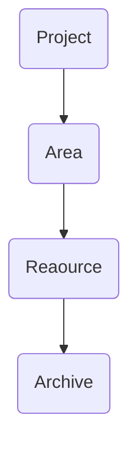

## 📒 This is Note of EGU1832.

#### 📁 Docs
> Space for related documents

# PARA

PARA는 디지털 생산성 전문가인 Tiago Forte가 개발한 시스템으로, 정보와 자료를 체계적으로 관리하기 위한 방법이다.

#### 📁 Project
- 현재 진행중인 프로젝트를 모아둔다.
- '시작'과 '끝'이 명확하고 목표를 달성하면 완료되는 작업들이다.

#### 📁 Areas
- 지속적으로 관리해야 하는 분야나 관심사를 모아둔다.
- 끝나는 시점 없이 꾸준히 유지하거나 발전시켜야 하는 영역이다.

#### 📁 Resource
- 참고 자료나 정보를 모아둔다.
- 특정 프로젝트에 사용될 수 있지만, 그 자체로는 완료되지 않는 자료들이다.

#### 📁 Archive
- 완료된 프로젝트나 더 이상 필요하지 않은 자료를 모아둔다.
- 나중에 참고할 가능성이 있지만, 현재는 필요하지 않은 것들을 정리한다.

실행도가 높은 순서에서 낮은 순서대로 정리하면 다음과 같다.

